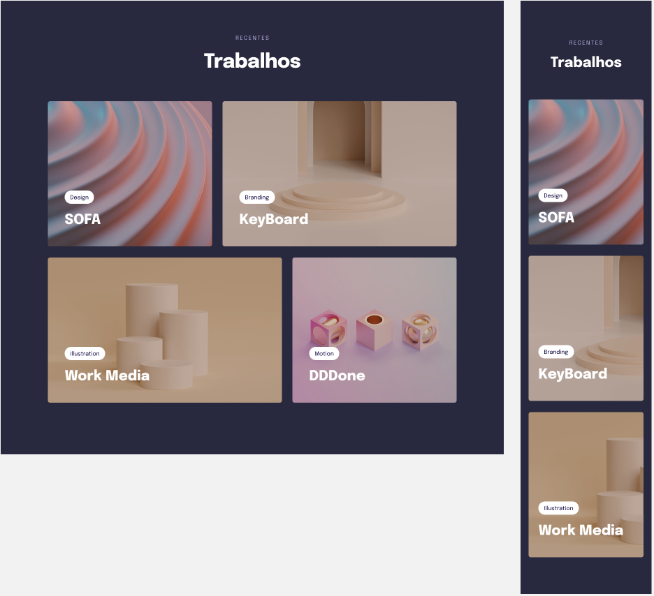

## 💻 Projeto

Esse é um projeto Web Responsivo de uma página para exibir imagens em cards, utilizando display: grid, transições, animações e responsividade.

## 🚀 Tecnologias

Esse projeto foi desenvolvido durante a aula com Mayk Brito da Rocketseat com as seguintes tecnologias:

- HTML
- CSS
- Git e Github

## 🏷️ Layout

Você pode visualizar o layout do projeto através [desse link](https://www.figma.com/file/Q64h0t6Imq2wgLdjQOhi7u/Explorer-Stage-03-Projeto-03-Copy?fuid=1240099488267647617).
É necessário ter uma conta do [Figma](https://www.figma.com).
